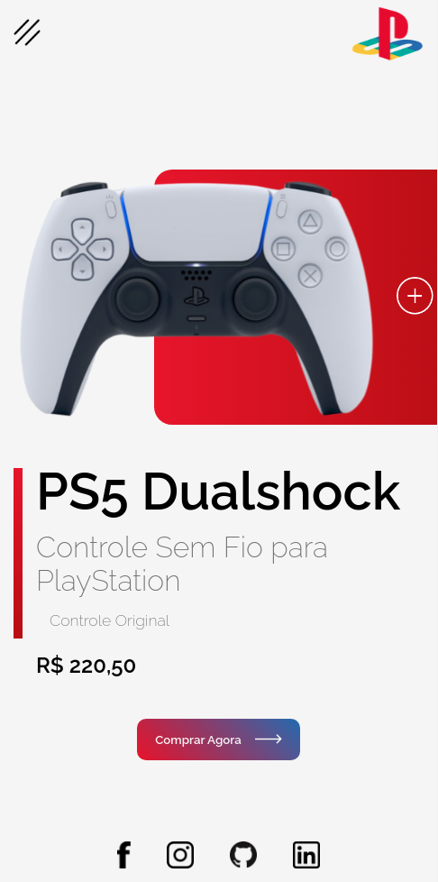
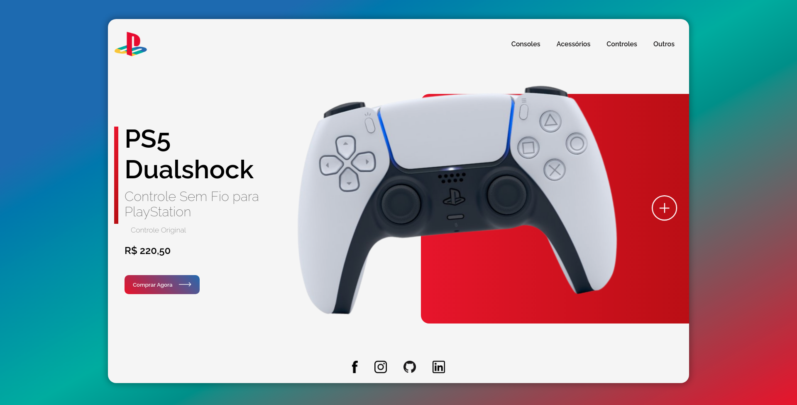

# PlayStation Store

## About
PlayStation Store is a project built basically using HTML and CSS. The focus was to make a website - the Front-end of a virtual store - responsive. I ended up using JavaScript to make the mobile menu, but the focus was to improve my semantics and discernment when dealing with HTML, and my mastery of CSS, when using media queries, display flex, organizing elements cimetrically...
Oh, I also made a functional form in the support tab, using formsubmit.co services.

## Result

Access the project <a href="https://luk4x.github.io/playstation-store/">HERE</a>

## Contributors Contact
<table>
  <tr>
    <td align="center">
      <a href="https://www.linkedin.com/in/lucasmacielf/">
         
        
          <b>Lucas Maciel</b>
        
      </a>
    </td>
  </tr>
</table>
